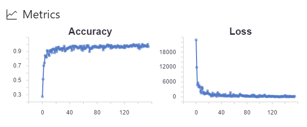

# Classify MNIST dataset using TensorFlow

This sample uses the popular [TensorFlow](https://www.tensorflow.org/) machine learning library from Google to classify the ageless [MNIST dataset](http://yann.lecun.com/exdb/mnist/) of handwritten digits.

## Logging code
The sample code is directly copied from TensorFlow sample code collections on GitHub. The only change we make is to add some Azure ML specific logging code into the experiment.

Here are the relevant code snippets:
```python
# reference the Azure ML logging library
from azureml.logging import get_azureml_logger
...
# initialize the logger
run_logger = get_azureml_logger()
...
# declare empty lists
metrics = []
losses = []
# during the training session
while step * batch_size < training_iters:
    ...
    # record accuracy and loss into a list
    metrics.append(float(acc))
    losses.append(float(loss))
    ...

# after the training finishes, log the list of accuracies and losses
run_logger.log("Accuracy", metrics)
run_logger.log("Loss", losses)
```

By adding the above logging code, when the run finishes, you can find the following graph plotted for you in the run history detail page.



## Instructions for running scripts from CLI window
You can run the scripts from the Workbench app, but it is more interesting to run it from the command-line window so you can watch the feedback in real-time.

Open the command-line window by clicking on **File** --> **Open Command Prompt**, then run `tf_mnist.py` in local Python environment installed by Azure ML Workbench by typing in the following command.
```
# first install tensorflow library using pip, you only needed to do this once.
$ pip install tensorflow

# submit the experiment to local execution environment
$ az ml experiment submit -c local tf_mnist.py
```

If you have Docker engine running locally, you can run `tf_mnist.py` in a Docker container.

>Note: this command automatically pulls down a base Docker image so it can take a few minutes before the job is started. But this only happens if you are running it for the first time. The subsequent runs will be much faster.

And you don't need to pip-install the _tensorflow_ library, since it is already specified in the `conda_depeendencies.yml` file under `aml_config` folder. The execution engine will automatically install it for as part of the Docker image building process.

```
# submit the experiment to local Docker container for execution
$ az ml experiment submit -c docker tf_mnist.py
```

You can also run `tf_mnist.py` in a Docker container in a remote machine. Note you need to create/configure myvm.compute.
```
# attach a new compute context
$ az ml computetarget attach --name myvm --address <ip address or FQDN> --username <username> --password <pwd> --type remotedocker

# prepare the Docker image
$ az ml experiment prepare -c myvm

$ az ml experiment submit -c myvm tf_mnist.py
```

## Running it on a VM with GPU
With computationally expensive tasks like training a neural network, you can get a huge performance boost by running it on a GPU-equipped machine.

>Note, if your local machine already has NVidia GPU chips, and you have installed the CUDA libraries and toolkits, you can directly run the script using local compute target. Just be sure to pip-install the _tensorflow-gpu_ Python package. The below instructions are specifically for running script in a remote VM equipped with GPU.

### Step 1. Provision a GPU Linux VM 
Create an Ubuntu-based Data Science Virtual Machine(DSVM) in Azure portal using one of the NC-series VM templates. NC-series VMs are the VMs equipped with GPUs for computation.

### Step 2. Attach the compute context
Run following command to add the GPU VM as a compute target in your current project:
```
$ az ml computetarget attach --name myvm --address <ip address or FQDN> --username <username> --password <pwd> --type remotedocker
```
The above command creates a `myvm.compute` and `myvm.runconfig` file under the `aml_config` folder.

### Step 3. Modify the configuration files under _aml_config_ folder
- You need the TensorFlow library built for GPU:
    
    In `conda_dependencies.yml` file, replace `tensorflow` with `tensorflow-gpu`.

- You need a different base Docker image with CUDA libraries preinstalled:

    In `myvm.compute` file, replace the value of `baseImage` from `microsoft/mmlspark:plus-0.7.91` to  `microsoft/mmlspark:plus-gpu-0.7.91`

- You need to use _NvidiaDocker_ command to start the Docker container as opposed to the regular _docker_ command.

    In `myvm.compute` file, add a line: `nvidiaDocker: true`

- You need to specify the run time framework as _Python_ as opposed to _PySpark_:

    In `myvm.runconfig` file,  change the value of `Framework` from `PySpark` to `Python`.

### Step 4. Run the script.
Now you are ready to run the script.
```
$ az ml experiment submit -c myvm tf_mnist.py
```
You should notice the script finishes significantly faster than than if you use CPU. And the command-line outputs should indicate that GPU is used for executing this script.
